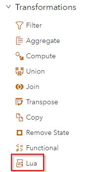
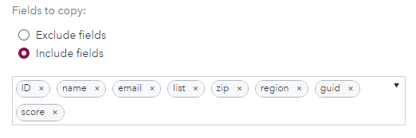
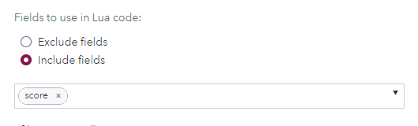
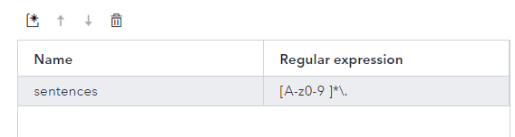
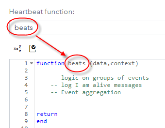
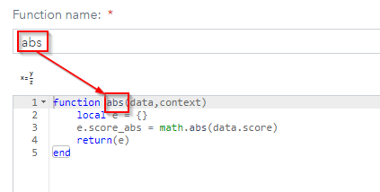

# SAS Event Stream Processing Lua window

## Table of Contents

* [Introduction](#introduction)
* [Lua Settings](#lua-settings)
	* ["Fields to copy" vs "Fields to use in Lua code"](#"fields-to-copy"-vs-"fields-to-use-in-lua-code")
	* [Using Regular Expressions](#using-regular-expressions)
	* [Heartbeat function](#heartbeat-function)
	* [Specifying the Lua function entry point](#specifying-the-lua-function-entry-point)
* [Use the print function to debug your code](#use-the-print-function-to-debug-your-code)
* [Lua function libraries and modules](#lua-function-libraries-and-modules)
	* [Built-in Lua functions](#built-in-lua-functions)
		* [Math Library examples](#math-library-examples)
		* [Operating System facility example](#operating-system-facility-example)
	* [ESP Provided](#esp-provided)
	* [Lua Custom functions written by you](#lua-custom-functions-written-by-you)
* [State Variables](#state-variables)
* [Summary](#summary)
* [License](#license)
* [Additional Resources](#additional-resources)

## Introduction

The 2021.1.5 ESP release (september 2021) introduces a new Window : the Lua Window. This window allows ESP developers processing events using Lua language scripting.

[Lua](https://www.lua.org) is a powerful, efficient, lightweight, embeddable scripting language. It supports procedural programming, object-oriented programming, functional programming, data-driven programming, and data description. These strenghts make it a very good embeded scripting language and one of the most used these days.

Lua provides many facilities for table manipulations, math operations, xml and json strings management. Lua also provides facilities for implementing extensions. The language is simple and dynamicaly typed.

ESP is designed to be a low-code design time environment. Most of the event and data processing is done using graphical modeling, using the multiple available windows, without writing a single line of code. Nevertheless, there are cases where it is usefull or required to use more complex transformations using custom functions or code. In ESP, multiple windows can be used for this purpose: The functional window, the compute window (using Expression Language), The Calculate window (using Python or DS2 MAS modules), the procedural window, using C/C++ plugins and now the Lua window.

Even though each of those windows has its pros and cons, it is clear that the Lua window seems to bring on itself most of the strenghts of all thoses windows for usual data processing. It is easy to use, faster to run, has an extensive set of instructions, and is widely used on many products, which makes it adoption faster and easier.

Based on those elements it makes perfect sense to **recommend now using the Lua window for all events processing where custom functions or code is required**, over the Functional, the Compute window and MAS Python or DS2 modules.

Nevertheless there are still cases where it is still recommended to use the other windows, as the Lua language doesn't have an appropriate support:

- If you need to run existing Python libraries that are only available in Python, or analytics (ONYX,...) or if you need to deploy analytics or decision scripts created in DS2, it is still required and recommended to use the Calculate window.

- If you need to use the Expression Language specific functions like matchcodes and use the QKB, these are only available in the Compute window.

For all other cases, the Lua window presents a better alternative and should be now considered as the first and prefered choice.

Please note that in order to keep a consistent scripting language over all ESP windows, and keep ESP as lightweight as possible, the Functional window and the Compute window are likely meant to become deprecated in future releases

This project will take you through the basic set up and normal use cases for using the Lua window.

Have fun.

 The Lua window is located in the Transformation second of ESP Studio.  Simply drag the window onto the canvas to get started. 

 


## Lua Settings

Before we actually call a Lua function there are a few settings that we can employ to make our code more efficient and they will be discussed here.    

### "Fields to copy" vs "Fields to use in Lua code"

On the Lua window when you open the paremeter pane you will see "fields to copy" and "fields to use".
These configurations will help to reduce the potential performance impact (and inutility) of passing all the fields through the lua code.

These parameters defines the fields passed to Lua or directly copied to the output event.

If you check copy with no selected fields, all fields will be copied to the output event.
Selected fields to copy will be copied directly to the output event.
Using exclude=true invert the logic and selected fields won't be be copied.

 

"Fields to use" has the same logic for passing fields to Lua.

 If no fields are specified, all fields will be passed to Lua. Exclude=true invert the behavior. With exclude=true all fields will be sent to Lua excepted the selected ones.

  

### Using Regular Expressions

You can use ESP defined regular expressions to break up incoming data into lists that can be parsed more easily.   Keep in mind that [Lua has its own pattern matching special character set](https://riptutorial.com/lua/example/20315/lua-pattern-matching) which is different than regex.  This section uses the regular expression (regex) object which enables you to perform regular expression searches of strings.   There is a very good example in the public documentation which is found [here](https://go.documentation.sas.com/doc/en/espcdc/v_025/espcreatewindows/p0yj92wgv3ssyyn1syatsh9l1t74.htm).

 

Using these expressions provides the ability to use regex from your Lua code to break up strings into a Lua table element.  

### Heartbeat function

 

At the ESP project level a heartbeat interval can be established.  The default is 1 second.  For example: 

```xml
<project name="Intellisense_lua" pubsub="none" threads="4" heartbeat-interval="1">
```

This means every Lua window in your project will be called 1 time per second.  If you create a Lua heartbeat function, this function will be called on each beat.  The `context` parameter of the heartbeat function is identical to that passed to the event creation function except that you do not specify an input value. You can use a heartbeat function to create events as you would with an events function.

### Specifying the Lua function entry point 

You can use a Lua code with multiple different functions. And there is no standard or pre-defined entry point function in the Lua window.
That's why ESP model needs to know which function is the entry point in the Lua code.

This function needs to have data and context as parameters.

- data will give access to the event's data.
- context will give the name of the source window. It will be useful to manage different source window in one Lua Window.

In the screenshot below we declare the abs function as the Function name and in the Lua code we have to declare this function the context and data as parameters.

 

## Use the print function to debug your code

During the develoment of your code you can need to debug and check the behavior of some logics. The best way to trace the execution is to use the print() function. You can place diferent prints into your code for tracing the different steps executed.

If you put multiple prints into your code it could become hard to identify in the log the associated print. In that case you can identify the variable's value you are printing with a keywork. Concatenation in Lua is made by placing two comma (..) between the string objects.
Associated with toString() function the print function will helps you to visualize your variables and objects into the ESP log.

In the example below we concatenate "PRINT Item:" with item variable value.

```lua
  print("PRINT Item :"..toString(item))
```

The output in the ESP log would ressemble to :

```lua
esp-server_1        | Print ITEM:13
esp-server_1        | 
```

It is also possible to print objects like lists. In the example below we print a list. See the details in the sample model, in generate_multiple_events window.

```lua
  function generate_evt(data,context)
      print("LIST :"..toString(data.list))
      ...
```

## Lua function libraries and modules

There are 3 types of functions that may be called.  

1. built-in and embedded Lua functions
2. ESP provided functions 
3. Custom functions written by you

### Built-in Lua functions

Libraries and modules offers a set of functions to enrich the built-in Lua functions. Lua window embedd the core libraries like Math, OS, ...

#### Math Library examples

Use math.abs() function to get an absolute value. This library is natively embedd in the Lua engine.

```lua
  function abs(data,context) 
    local e = {}
    e.score_abs = math.abs(data.score)
    return(e) 
  end
```

#### Operating System facility example

As for math library, Lua OS functions can be used natively.
Use os.time to create an Unix timestamp and a new index. In the demo model TID is an index.

```lua
  e.TID = os.time(os.date("!*t"))
```

### ESP Provided

SAS Event Stream Processing provides a set of functions that you can invoke within Lua code.  As of this writing these are the supported functions.  Please refer to the [product documentation](https://go.documentation.sas.com/doc/en/espcdc/v_025/espcreatewindows/p0yj92wgv3ssyyn1syatsh9l1t74.htm#p0016t7rqmfxppn1miicaxhfgg33:~:text=%3C/code%3E-,Using%20SAS%20Event%20Stream%20Processing%20Functions%20with%20Lua,-Overview )  for a current list. 

- JSON Parsing

- XML Parsing

- Regular Expressions

- ESP logging 

- GUID Generation 

- Data and Time Functions

- Sending HTTP Requests 

  

### Lua Custom functions written by you

You may create a custom function by simply creating a new local function inside your project.  Then call the new function from your main Lua code.  For example, let's say you have a string that is separated by "/".  You need to code a custom function that would parse this string by the delimiter "/" into separate words.  Your code might look something like this: 

```lua
local function splitbydelimiter(
    s,   -- string value
    delimiter,  -- string value with defines the delimiter. default is ","
    item )   -- number:  item in array to return.  Let's say you want the 3rd item parsed from string  "item1,item2,item3"
             --  if you say 2 item2 will be returned.  Note that Lua arrays start at 1 and not 0.  
    -- returns table of split items or item entry or nil
    answer = {};
    delimiter1 = delimiter or ","
    for word in string.gmatch(s,"(.-)"..delimiter1) do
        table.insert(answer, word);
        print ("word result...............................", word )
    end
    print ("answer .... ", #answer)
    if #answer == 0 then result = nil    -- return nil if nothing found. 
    elseif item then  -- does the user want an entry verses a parsed table?
        if #answer >= item then 
            result = answer[item]
        else result = nil     
        end 
    else  result = answer    
    end 
return result;
end
```


If you are going to need this code in many Lua windows or it is just too large and distracting you can move it into a separate file called a **module.**  The function called require() will load your module into memory and pass the address to the variable specified. 

In the example below we load splitter.lua into the mylibmodule variable.

```lua
mylibmodule=require("/opt/sas/data/splitter.lua")
```

There is a bit more formatting that needs to be done to make a Lua module.  You can read about it here:  [https://www.tutorialspoint.com/lua/lua_modules.htm](https://www.tutorialspoint.com/lua/lua_modules.htm)

If you want to share your awesome code with the world it can be packaged for being distributed. The Lua modules package manager is called Luarocks.  Refer to the Luarocks documentation for the details of this process. 

## State Variables

Normally when you call a function from an ESP window, the function only has the information passed to it by the current event being processed.  While this is true of the Lua windows as well, the Lua window also possesses the lability to maintain variable state if defined correctly.   Consider the following code snippet. 

```lua

local devicetable = {}  -- store devicetable here

-- take each record from the devicetable and build an internal table keyed by deviceid
local function builddevicetable(
    d)  -- table which contains one row read in by source window
  -- returns updated devicetable 
  if d.deviceid then -- ignore if null 
    devicetable[d.deviceid]={}  -- new tbl keyed by deviceid 
    devicetable[d.deviceid]["manufacturer"]=d.manufacturer
    devicetable[d.deviceid]["partnumber"]=d.partnumber
  end     
return 
end 
function create(data,context)
    
    local event = {}
    if context.input == "ReadDeviceTable" then 
        builddevicetable(data)  
        event = nil;
    else         
      local parsedmessage = parseJson(data.message)
        
        .
        .
        .	
```

 

My main function is called **create** and will be called for each incoming event.  I also have a custom function called builddevicetabe().   Notice how the local variable called **devicetable** is defined outside of both functions.  When a variable is outside of the functions, these variables remain statefull.  This allows me to create a table of devices that can be referenced when new events are processed.  

## Summary

Using this base you should now be able to get started using Lua in your ESP projects.  Look for more projects like this that will tackle individual use cases like, JSON parsing, event creation etc. 

## License

This project is licensed under the SAS License Agreement for Corrective Code or Additional Functionality.

## Additional Resources

* [SAS Event Stream Processing Product Documentation](https://go.documentation.sas.com/doc/en/espcdc/v_025/espcreatewindows/p0yj92wgv3ssyyn1syatsh9l1t74.htm)
* [https://www.tutorialspoint.com/lua/lua_modules.htm](https://www.tutorialspoint.com/lua/lua_modules.htm)
* [Lua has its own pattern matching special character set](https://riptutorial.com/lua/example/20315/lua-pattern-matching)
* [Luarocks package manager](https://luarocks.org/)

  

